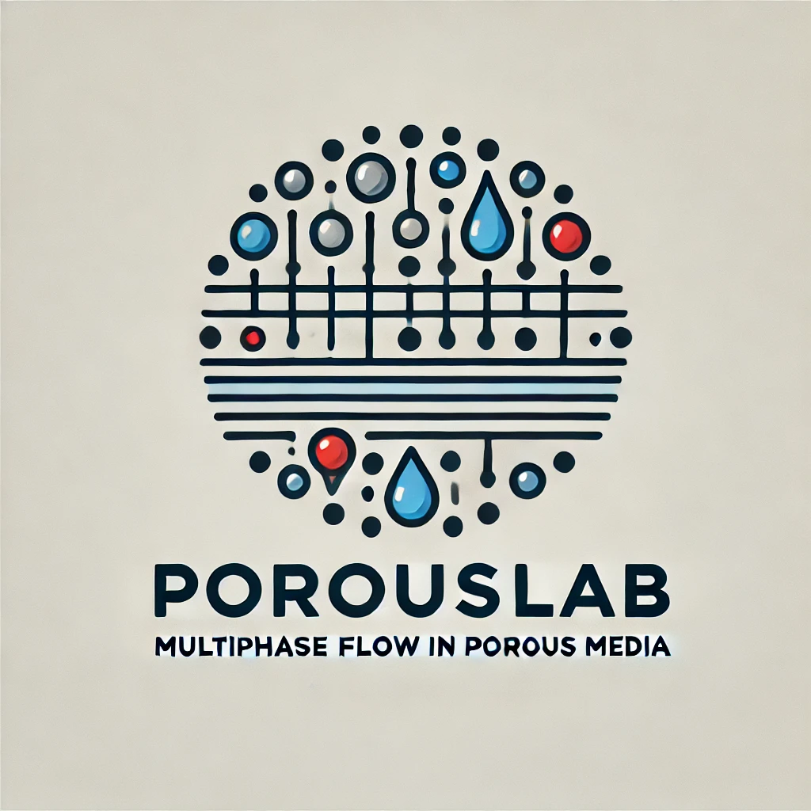
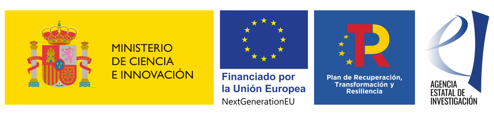

# porousLab

![Release][release-image] 
![License][license-image]

[release-image]: https://img.shields.io/badge/release-1.0.0-green.svg?style=flat 

[license-image]: https://img.shields.io/badge/license-MIT-green.svg?style=flat

**porousLab** is a MATLAB program for solving multiphysics problems, mainly in the context of geomechanics and fractured porous media, based on the Finite Element Method (FEM).

---

### **Navigation**
- [Features](#features)
- [License](#license)
- [Authors and Acknowledgment](#authors-and-acknowledgment)

---

## **Features**

Check out the [wiki](https://github.com/dbcavalcanti/porousLab/wiki) page!

---

## **License**

porousLab is released under the MIT License. See the **[LICENSE](https://www.blackbox.ai/share/LICENSE)** file for details.

---

## **Authors and Acknowledgment**

porousLab was created by **[Danilo Cavalcanti](https://github.com/dbcavalcanti)** in the context of the SECCO2 project under the Grant TED2021-130510A-I00 funded by MCIN/AEI/10.13039/501100011033 and by the "European Union NextGenerationEU/PRTR.”

