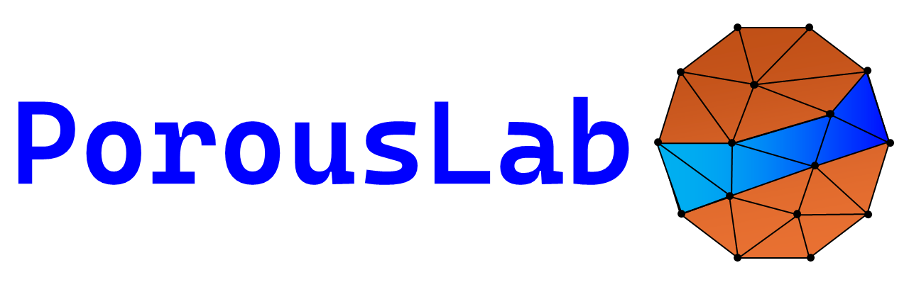
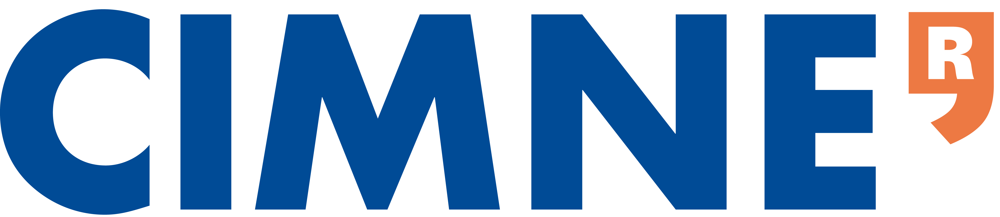
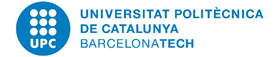
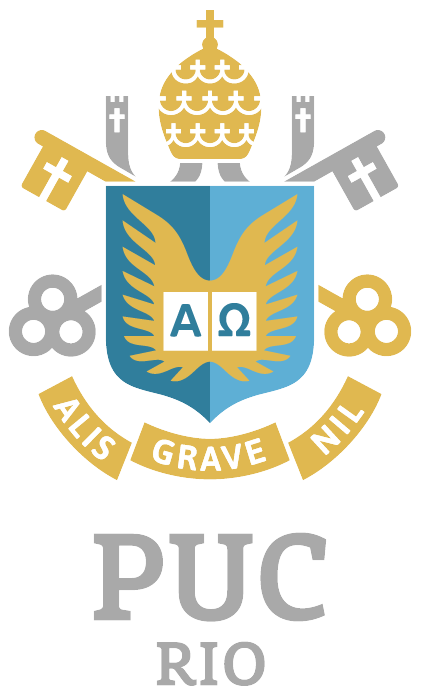
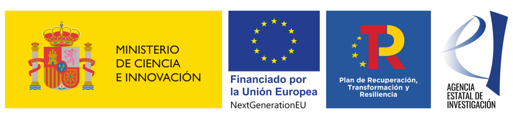

# PorousLab

[![Release][release-image]][release-link]
[![License][license-image]][license-link]
[![Contributing][contributing-image]][contributing-link]

**PorousLab** is a MATLAB framework based on the Finite Element Method (FEM) for solving multiphysics problems, mainly in the context of geomechanics and fractured porous media.

## Table of Contents
- [Main Features](#main-features)
- [How to Contribute](#how-to-contribute)
- [How to Cite](#how-to-cite)
- [Authorship](#authorship)
- [Acknowledgement](#acknowledgement)
- [License](#license)

## Main Features

Check out the [wiki][wiki_link] page.

## How to Contribute

Please check the [contribution guidelines][contribute_link].

## How to Cite

If you use this software in your work, please cite it using the metadata indicated in this [file][citation_link].

## Authorship

**Danilo Cavalcanti** (<dborges@cimne.upc.edu>)

- International Center for Numerical Methods in Engineering ([CIMNE][cimne_website])  
- Polytechnic University of Catalonia ([Barcelona Tech - UPC][upc_website]) 
- Pontifical Catholic University of Rio de Janeiro ([PUC-Rio][puc_website])

&nbsp;&nbsp;&nbsp;&nbsp;&nbsp;

&nbsp;&nbsp;&nbsp;&nbsp;&nbsp;

## Acknowledgement

PorousLab was developed in the context of SECCO2 project under the Grant TED2021-130510A-I00 funded by MCIN/AEI/10.13039/501100011033 and by the "European Union NextGenerationEU/PRTR”.

## License

PorousLab is released under the [MIT license][mit_license_link].
It allows the program to be freely used by anyone for modification, private use, commercial use, and distribution, only requiring preservation of copyright and license notices.
No liability and warranty are provided.

[release-image]: https://img.shields.io/badge/release-1.0.0-green.svg?style=flat
[release-link]: https://github.com/bcavalcanti/porousLab/releases
[license-image]: https://img.shields.io/badge/license-MIT-green.svg?style=flat
[license-link]: LICENSE
[contributing-image]: https://img.shields.io/badge/Contributor%20Covenant-2.1-4baaaa.svg
[contributing-link]: CONTRIBUTING.md
[wiki_link]: https://github.com/dbcavalcanti/porousLab/wiki
[contribute_link]: CONTRIBUTING.md
[citation_link]: CITATION.cff
[cimne_website]: https://www.cimne.com/
[upc_website]: https://camins.upc.edu/
[puc_website]: https://www.puc-rio.br/english/
[mit_license_link]: https://choosealicense.com/licenses/mit/
